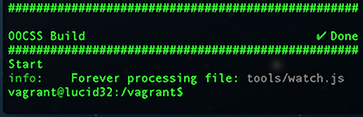

# Setting Up Your Dev Environment

* [Project overview](#overview)
    * [Vocabulary](#vocab)
* [Required tools](#required-tools)
    * [Vagrant](#required-vagrant)
    * [Virtual Box](#required-virtual)
    * [Git (gui or command line)](#required-git)
* [Setup Github](#setup-github)
* [Setup Vagrant](#setup-vagrant)
    * [What is Vagrant](#what-vagrant)
    * [Before starting Vagrant](#before-vagrant)
    * [Vagrant via batch files](#vagrant-batch)
    * [Vagrant via the command line](#vagrant-command)
* [Build the project](#build)
* [Test the project in a browser](#test)
* [Knowns issues](#issues)

## Project overview
The project uses a custom environment that automatically installs most of the tools you'll need to get started. We're trying to make the setup as painless as possible, so any feedback is very welcome. If you just want to see what's going on, but you don't want to do development yourself, you won't need to worry about the rest of this section. You can skip to Required Tools, and start getting things set up. 

If you'll be doing development with us, we'll write SASS, handlebars, JavaScript, and JSON, all of which can be found in the /src/ directory. This will compile to CSS, HTML, and concatenated JavaScript in the /build/ directory. We use watchers which poll for changes to all of these files so you don't need to manually recreate the build directory each time you make modifications. 

After we've done the basic setup, we'll guide you through making a new button skin so you can see how all the pieces play together.

### Vocabulary

1. **build** : Take source files, compile them and put them into the final directory called “build”

1. **watch** : Listen for changes to the source files of the project and automatically start the build

## Required tools

You will need to install three tools in order to have a complete working environment; Vagrant, Virtualbox, and Git.

### Vagrant  
Used for launching the working environment  
[http://downloads.vagrantup.com/](http://downloads.vagrantup.com/)  
Download Vagrant : [mac](http://files.vagrantup.com/packages/64e360814c3ad960d810456add977fd4c7d47ce6/Vagrant.dmg) | [windows](http://files.vagrantup.com/packages/64e360814c3ad960d810456add977fd4c7d47ce6/Vagrant.msi)

### Virtualbox
Used by Vagrant  
[https://www.virtualbox.org/wiki/Downloads](https://www.virtualbox.org/wiki/Downloads)  
Download Virtualbox : [mac](http://download.virtualbox.org/virtualbox/4.2.10/VirtualBox-4.2.10-84104-OSX.dmg) | [windows](http://download.virtualbox.org/virtualbox/4.2.10/VirtualBox-4.2.10-84105-Win.exe)

### Git (gui or command line)
You can choose to use git via the command line or a gui. We quite like Git Tower as it works well with our workflow. Please don't use Github for mac as we had a lot of conflict issues with it in the past.

Download Git Command Line: [mac](http://git-scm.com/download/mac) | [windows](http://git-scm.com/download/win)  
Download Git Tower : [mac](http://www.git-tower.com/)   
Download TortoiseGit : [win](https://code.google.com/p/tortoisegit/wiki/Download?tm=2)

## [Setup Github](https://help.github.com/articles/fork-a-repo)
1. **Fork the repository** - by clicking the "fork" button on the project page in github.

1. **Clone the fork locally** - We recommend Git Tower or the command line. Do not use the Github native app as it has caused major merge conflicts for us in the past.

## Setup Vagrant

### What is Vagrant?
Vagrant is a virtual machine manager that will automatically download and setup a working environment for the project. You'll simply start and stop vagrant when you begin and end working on the project. The first time you start vagrant, it may take several minutes to prepare the environment.

### Before starting Vagrant
First you need to update your git project by pulling the latest changes from repository. This will ensure you have the latest version of the build.

The first time you start Vagrant may take a several minutes to download the Virtual Machine (about 200 MB to download). Each time you start/stop vagrant it takes a couple of minutes as well.

After you update your project, there are two ways to start Vagrant: via [batch files](#vagrant-batch) or via [command line](#vagrant-command).

If you don't feel comfortable with the command line, we recommend you start Vagrant via the batch files.

### Vagrant via batch files 

#### Start Vagrant

1. Inside the OOCSS folder, you will find a folder called `/start/`.

1. Inside the start folder, you will find batch files to start the virtual machine when you are ready to begin working on the project.  
If you are on Mac, click on `mac-start.command`.  
If you are on Windows, click on `win-start.bat`.

1. A terminal window will open up to begin the build of the project. You will see a message saying the build is done after a while:  

  
  Starting Vagrant via batch file will build and watch your project, i.e. it will automatically compile your updates when you make changes to your files.

1. Now you are ready to start working on your project. As long as you leave the terminal open, Vagrant will watch for changes. When you make changes to your handlebars, Sass or JavaScript files. You won't see the process show the changes. 

     Make sure you leave the terminal open. It will automatically close when you stop the virtual machine by running the stop vagrant batch file.

#### Stop Vagrant
1. You can leave Vagrant running for as long as you like, but when you want to stop working on the project,  in the `/start/` folder you will see batch files to stop the virtual machine.  
If you are on Mac, click on the `mac-stop.command`.  
If you are on Windows, click `win-stop.bat`.  
This will open a terminal window. 

1. When the process is completed, you can close the terminal window.

### Vagrant via the command line
You can set up Vagrant via the command line if you feel comfortable with it. Note: If you start vagrant by using `vagrant up` in command line, you will need to run the build and watch commands yourself.

These are the essential commands you'll be interested in:

* `vagrant up` - Starts Vagrant. A virtual machine will be downloaded. Run this command from your project directory.
* `vagrant ssh` - Access the VM.
* `vagrant halt` - Stops the VM.

## Build the project

If you will be doing development on the project, you'll need to know a bit more about the build system. If not, you can happily skip this section. We use Make to create the style guide and the rest of the build directory.

Some common commands you'll need:

* `make build` - Creates the style guide and all the JavaScript, HTML, and CSS files required for it.
* `make watch` -  Watches JavaScript, handlebars, and Sass files When any changes are saved, it automatically rebuilds the project so you can see the latest changes.
* `make bw` - Runs `make buil`d and `make watch` at the same time.
* `make component -name [component name]` - Create a new component with the name you specify. E.g. `make component -name button`. This will automatically create the component folder, Sass, handlebar and JavaScript files.

## Test the project in a browser
After you've run the batch files or built the project via command line,  you are ready to see the library in the browser by going to the following URL: [http://localhost:8080](http://localhost:8080)

Alternatively, you can directly access the component library of the project inside the `/build/` directory. You’ll find the compiled CSS, JavaScript, and HTML inside the `/build/` directory.

## Knowns issues

### Port 8080 already used:
If you start a VM and get this message: 
> Vagrant cannot forward the specified ports on this VM, since they would collide with another VirtualBox virtual machine's forwarded ports! The forwarded port to 8080 is already in use on the host machine.

To fix this:

1. modify your current projects Vagrantfile to use another port. In example below, '1234' would be replaced by a unique host port:  
`config.vm.forward_port 80, 1234`

1. Open Virtual Box
1. Select each VM and Pause it (CMD + P) or Power Off it (CMD + F)
1. Close Virtual Box and run `vagrant up` or `vagrant resume`again.

